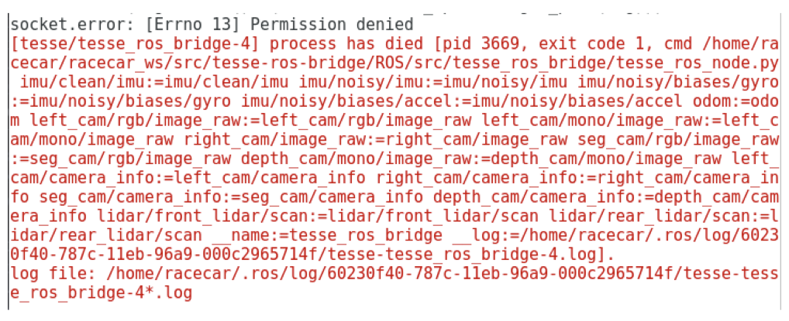

# Setting up the Photorealistic TESSE Simulator

| **Due Date**  | **Friday, March 5th at 11:59 PM ET**                                 | **Wednesday, March 10th at 1:00 PM ET** |
|---------------|----------------------------------------------------------------------------| -----------------------------------|
|  **Submission**   | [Computer specs survey](https://forms.gle/F2nZF36xe85Bzqex5) | [TESSE screenshot survey](https://forms.gle/DMMbMqEnKWnUjFdd7)

## Introduction
With the advent of modern computer graphics software and hardware, graphics and physics simulators have become increasingly pervasive in robotics.
Many simulators, such as
Toyota Research Institute’s [Drake](https://drake.mit.edu/),
Microsoft’s [AirSim](https://microsoft.github.io/AirSim/), and
LIDS’s [FlightGoggles](https://flightgoggles.mit.edu/) have found success in research and industry.
The latter two, in particular, leverage advances in video game physics and rendering engines to create high-fidelity environments to safely and efficiently test robotic algorithms in.
For our remote labs, we will be using one such simulator.

We will be using the TESSE simulator, developed in Unity3D by MIT Lincoln Laboratory and SPARK Lab.
This simulator will enable you to visualize and drive the car within a photorealistic 3D simulation environment!
You’ll be able to drive with car-like dynamics and your car will be able to drift, skid, turn over, collide, and interact with objects in the simulator, much like a real car.
You can see a demo of the car driving around the final race course from last year [here](https://www.youtube.com/watch?v=MItig9HHPyk&ab_channel=MITSPARKLab).
If you are interested in the TESSE simulator source code, you can find it [here](https://github.com/MIT-TESSE/).
We will be using a modified version of this simulator for RSS.

##### Links
* Drake: [https://drake.mit.edu/](https://drake.mit.edu/)
* Airsim: [https://microsoft.github.io/AirSim/](https://microsoft.github.io/AirSim/)
* FlightGoggles: [https://flightgoggles.mit.edu/](https://flightgoggles.mit.edu/)
* Final Race Course: [https://www.youtube.com/watch?v=MItig9HHPyk&ab_channel=MITSPARKLab](https://www.youtube.com/watch?v=MItig9HHPyk&ab_channel=MITSPARKLab)
* MIT TESSE repository: [https://github.com/MIT-TESSE/](https://github.com/MIT-TESSE/)

## Submission

You have _two_ Google Form surveys to fill out. The [first one](https://forms.gle/F2nZF36xe85Bzqex5) is asking for your computer specs and should be submitted as soon as possible (with an actual deadline of March 5th at 11:59 PM ET). It is the same one in the following section. The [second](https://forms.gle/DMMbMqEnKWnUjFdd7) is asking for confirmation that you set up TESSE correctly, plus TESSE's performance. This is due at the same time as the wall following lab (March 10th, 1:00 PM ET). **However, we suggest you get started on this as soon as possible in case you need to debug the install with a TA.**

## Computer Specs Survey

Before you start on the install below, please fill out this form: https://forms.gle/F2nZF36xe85Bzqex5

We are collecting this information to see if anyone will have potential problems with running the following simulator.

## ROS Bridge in VM

**NOTE: We will now set up the ROS bridge inside your VM - if you are running native Linux and not using a VM, you can set up the ROS bridge on your native machine.**

To communicate with the TESSE simulator, you will need a ROS bridge.
The ROS bridge will play the role of the racecar_simulator ROS package, to provide you with some standard rostopics that you will become familiar with throughout future labs.

In **your VM**, open a terminal and run the following sets of commands:

### Steps to install ROS bridge

#### 1) Clone repo

`cd ~/racecar_ws/src/`

`git clone git@github.mit.edu:rss/tesse-ros-bridge.git`

#### 2) Initialize submodules

`cd tesse-ros-bridge/`

`git submodule init`

`git submodule update --init --recursive`

#### 3) Install tesse python package

`cd tesse-interface`

`pip install -r requirements.txt`

`python setup.py develop --user`

#### 4) Some more dependencies; you should already have them

NOTE: incl. latest version of opencv-python that supports for 2.7

`pip install empy opencv-python==4.2.0.32 PyYAML scipy scikit-build pandas`

#### 5) Install dependencies from rosinstall file using wstool

`sudo apt-get install python-wstool`

`cd ../..`

`wstool init`

`wstool merge tesse-ros-bridge/ROS/install/tesse_ros_bridge.rosinstall`

`wstool update`

#### 6) Compile code

`cd ../`

`catkin_make`

#### 7) Refresh environment

`source ~/racecar_ws/devel/setup.bash`

## Networking Setup Between VM and Host Machine

**NOTE: You only need to go through the steps in this section if you are using a VM.
You do not need to set up networking if you are running Linux natively.
If you are running native Linux, skip this section.**

Change your Network Adapter setting (VM > Settings > Network Adapter on Windows, Virtual Machine > Settings > Network Adapter on MacOS) on your VM from “bridged” or “NAT” to “host-only” (it might be called “Private to my Mac” on MacOS).
Unfortunately, you will not have access to the internet from within your VM in “host-only” mode, so if you need internet access, switch back temporarily.
Be sure to switch back to “host-only” in order to use the simulator.
After you have switched to host-only mode, find your VM and your host IP addresses:

In **your VM**, open a terminal and run `hostname -I`. The output is the IP address for your VM.

On **your host machine**, follow the instructions for your specific host OS:

### MacOS

In a terminal, run `ifconfig | grep XXX.XXX.XXX`, where XXX.XXX.XXX is the first three entries of your VM IP address that you found above.
So if your VM IP is 172.16.18.128, you would run `ifconfig | grep 172.16.18`.

In the line that is returned, you should see two different IP addresses with matching subnets, something like:
`inet 172.16.18.1 netmask 0xffffff00 broadcast 172.16.18.255`
The first IP address listed (the one ending in 1, not 255) is your host machine IP.

### Windows

Press (windows key) + R and type “cmd.exe” into the textbox to open a command prompt (cmd.exe).
At the shell prompt, type `ipconfig`.
The output of ipconfig will list various network interfaces and their associated IP addresses.
Look out for an entry that looks something like “Ethernet Adapter ??? (?? VMware ??)” and make note of the IP address listed under “IPv4 Address”.
If it has the form 192.xxx.yyy.z and the xxx and yyy (or yy) numbers match your VM’s IP address, then you can be sure that this is the IP address you want to use as your host machine’s IP address.

### Final step for either OS

Once you have found both of your IP addresses (VM and host machine), open the launch file in your VM at ~/racecar_ws/src/tesse-ros-bridge/ROS/launch/tesse_bridge.launch.
Here, you will need to make two changes: 1) set the default argument for sim_ip to your host machine IP, and 2) set the default argument for self_ip to your VM IP.

## TESSE Simulator Executable on Native OS

**NOTE: Complete this section on your host OS, not a VM - the TESSE executable would be too slow if you tried to run it from within your VM.
Instead, it will communicate with your VM through a local network which you will set up in the following sections.**

Download the Unity executable corresponding **to your host OS** [here](https://drive.google.com/drive/folders/1ueXze_U5NYQe6BfhmdkcbjH0JcV2cUlW?usp=sharing).
Go to the folder corresponding to **your native OS**, and download the zip file.
If there are multiple zip files, download the latest one (highest version number).
Once downloaded, unzip it.

Verify that your downloaded copy of the simulator binary / application / executable works by running it.
This will work slightly differently depending on your host operating system but essentially you need to navigate deeper into the package contents until you find the Unix executable called “TESSE” (follow your OS-specific instructions below).

#### MacOS

When you unzip the download the folder will contain a single .app directory.
Navigate to this directory in your terminal, then:

`cd Contents/MacOS`

`chmod +x TESSE`

`./TESSE`

The first time you do this it may refuse to open due to security preferences - click the Cancel button and open your System Preferences.
Select Security & Privacy: at the bottom you should see a message that says “TESSE was blocked from use because it is not from an identified developer.”
Click the “Open Anyway” button, then the “Open” button on the popup that comes up.
You will only have to do all this the first time you run a given executable - in the future it should run fine with `./TESSE`.

#### Linux

Navigate into your unzipped executable directory and then run:

`chmod +x <executable_name>.x86_64`

`./<executable_name>.x86_64`

#### Windows

On Windows, open a command prompt by pressing (windows key) + R and typing cmd.exe.
In the command prompt, navigate to the TESSE executable’s directory using the `cd` command.
You can use the command `dir` to check what is in a directory (analogous to `ls`).
Start TESSE by running `.\TESSE.exe`.

### Test drive in the simulator

Once you launch the executable on your host machine, you should be able to drive the car around in the simulated environment with your keyboard.
At this point you won’t be able to get data to or from the simulator via ROS just yet; first you will need to set up the network between your VM and the simulator, which we will do in the later sections.
Some key commands to try out while driving around in the TESSE simulator window

- Shift+T:      disable keyboard input
- w,a,s,d:      control agent using forces
- r:            respawn agent
- ESC:          quit game

### Testing your setup

To test if your networking is set up properly, first launch the unity executable **on your host machine**:

#### MacOS

On MacOS, navigate to Contents/MacOS in the .app, and from there run `./TESSE --client_ip_addr <VM IP>`, plugging in the IP address you found on your VM in the Networking section.

#### Linux

On Linux, Navigate into your unzipped executable directory and then run:

`chmod +x <executable_name>.x86_64`

`./<executable_name>.x86_64`

#### Windows

On Windows, open a command prompt by pressing (windows key) + R and typing cmd.exe.
In the command prompt, navigate to the TESSE executable’s directory using the `cd` command.
Start TESSE and provide your VM’s IP address on the command line by running `.\TESSE.exe --client_ip_addr <VM IP>`, plugging in the IP address you found on your VM in the Networking section.
(Note that you may also use Powershell in Win10 if you want some Linux-esque commands.)

At this point, you should see the simulator window with the car, and you can move this car around using the key commands as in the previous section.

#### Final testing steps for every native OS

Next, switch to **your VM**.

Launch the ROS node in a terminal by running:

`roslaunch tesse_ros_bridge tesse_bridge.launch`

After some time, it should start repeatedly setting intrinsic parameters for lidar without throwing any errors.

Then launch rviz in a new terminal:

`cd ~/racecar_ws/src/tesse-ros-bridge/ROS/`

`rviz -d rviz/tesse_rss.rviz`

In rviz, make sure that you can see the laser scan from the simulator, and that it moves around when you move your car around in TESSE on your host machine.

You can also run `rostopic list` to see what topics are being published, and `rostopic echo /tesse/odom` to see that odometry data is being published.

If you get a clock error, check that you launched the executable with the --client_ip_addr flag and that you set it to the VM IP.
For more troubleshooting tips, see the next section on troubleshooting.

## Troubleshooting Networking

#### 1) socket error
If you see the following `socket.error` when you roslaunch the bridge node (and don’t see anything in rviz):

It’s possible your IP address has changed and you will need to go through the steps in the Networking section again with the new IP address(es) - this may happen periodically.

It may also be that you set your IP addresses incorrectly - double check that you followed all of the IP-related instructions in the Networking section correctly.

Another possibility is that you have a firewall preventing communication - make sure that you don't have a firewall up on your host machine, and if that doesn't work you can try running the following commands from within your VM to turn off any firewalls (they will be backed up so you can restore them later if desired):

`export PATH=$PATH:/sbin`

`sudo iptables -S > iptables.bak`

`sudo iptables -F`

`cd ~/racecar_ws`

`catkin_make`

`source ~/racecar_ws/devel/setup.bash`

#### 2) clock_cb AttributeError

If you get the following error message after initialization:

`('TESSE_ROS_NODE: clock_cb error: ', AttributeError("'NoneType' object has no attribute 'metadata'",))`

This means that the simulator isn’t responding to requests.
Wait a few seconds; the simulator sometimes takes a long time to set up the sensors.

At some point the simulator will unfreeze and you’ll stop getting the error; everything should be good.
If this continues ad infinitum and the simulator maintains a high (or crazy low) fps, contact us.

#### 3) image_cb AttributeError

If you’re getting an error like above but with image_cb instead of clock_cb , try restarting your simulator.
Sometimes it doesn’t like it when you kill the ROS bridge and restart it soon after.

#### 4) not seeing odometry data published to /tesse/odom

If you’re on Windows with a VM and you’re not seeing data published to `/tesse/odom`, set use_broadcast to true in the launch file.

#### 5) not seeing laser scan data in rviz

If you don't see laser scan data visualized and there are no errors, check that Global Options > Fixed Frame is set to `base_link_gt` in RViz.
If it is, try switching it to another option, then switching back to `base_link_gt`.

## TESSE Submission

Once you are done with the TESSE setup, please submit this Google Form: https://forms.gle/DMMbMqEnKWnUjFdd7
